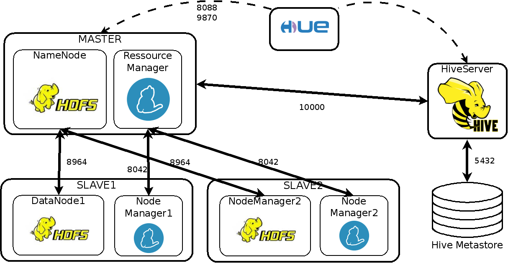

# prerequisits

you'll need a [docker engine](https://docs.docker.com/install/linux/docker-ce/ubuntu/) and [docker-compose](https://docs.docker.com/compose/)

# Setting

Clone this repo

add an `.env` file at the root

```
CLUSTER_NAME=the_name_of_your_cluster
ADMIN_NAME=your_name
ADMIN_PASSWORD=def@ultP@ssw0rd
INSTALL_PYTHON=true # whether you want python or not (to run hadoop streaming)
INSTALL_SQOOP=true
```

## Start, Stop and Monitor the stack
start the stack
```
docker-compose up -d --build
```

stop it

```
docker-compose down
```

See logs 

```
docker-compose logs -t -f
```

alternatively, you can also create user and import data stored in `supports/data` in HDFS. 

```
chmod +x setup.sh
./setup.sh
``` 

access hdfs through the name node
```
sudo docker exec -it namenode bash
```

# Relevant locations

- hadoop streaming `/opt/hadoop-3.2.1/share/hadoop/tools/lib/hadoop-streaming-3.1.1.jar`

# Web interfaces: 
- [Yarn ressource manager](http://localhost:8088)
- [hue](http://localhost:8000)
- [namenode overview](http://localhost:9870)

# Sources
Most sources were gathered from [big-data-europe](https://www.big-data-europe.eu/)'s repos
[main repos](https://hub.docker.com/r/bde2020)
[base of the docker-compose](https://github.com/big-data-europe/docker-hadoop/blob/master/docker-compose.yml)
parts added
[hue](https://hub.docker.com/r/gethue/hue)
[hiveserver2](https://hub.docker.com/r/bde2020/hive/)

# Usefull ressources
[complete list of HDFS commands](https://hadoop.apache.org/docs/current/hadoop-project-dist/hadoop-common/FileSystemShell.html)
[Udemy Hadoop course](https://www.udemy.com/course/the-ultimate-hands-on-hadoop-tame-your-big-data/)

# Example usage
## Downloading some data and putting it into the HDFS
Go into the namenode and download some data
```
# Go into the namenode container
docker exec -it namenode bash

# Install some software utilities
apt-get install wget unzip

# Download some data into the hadoop-data directory
cd /hadoop-data
wget "http://files.grouplens.org/datasets/movielens/ml-100k.zip"

# Extract the zip file and remove redundant files
unzip ml-100k.zip
rm ml-100k.zip

# Create a directory in HDFS and print out where it is located
hadoop fs -mkdir -p playground # The -p is important!
hadoop fs -find / -name "playground" # Yields /user/root/playground

# Copy the data into HDFS and verify it worked
hadoop fs -copyFromLocal ml-100k playground/
hadoop fs -ls playground/ml-100k
```

Now, browse the HDFS file system from the [UI of the namenode](http://localhost:9870/explorer.html#/user/root/playground/ml-100k) 
and convince yourself that the data is really there!

## Load some data into HIVE
To loading some data from HDFS into HIVE, open the [UI of hue](http://localhost:8000/), 
open up a new HiveQL query console and execute the commands shown in 
`hue/queries/load_ratings_into_hive.sql` or `hue/queries/load_names_into_hive.sql`
